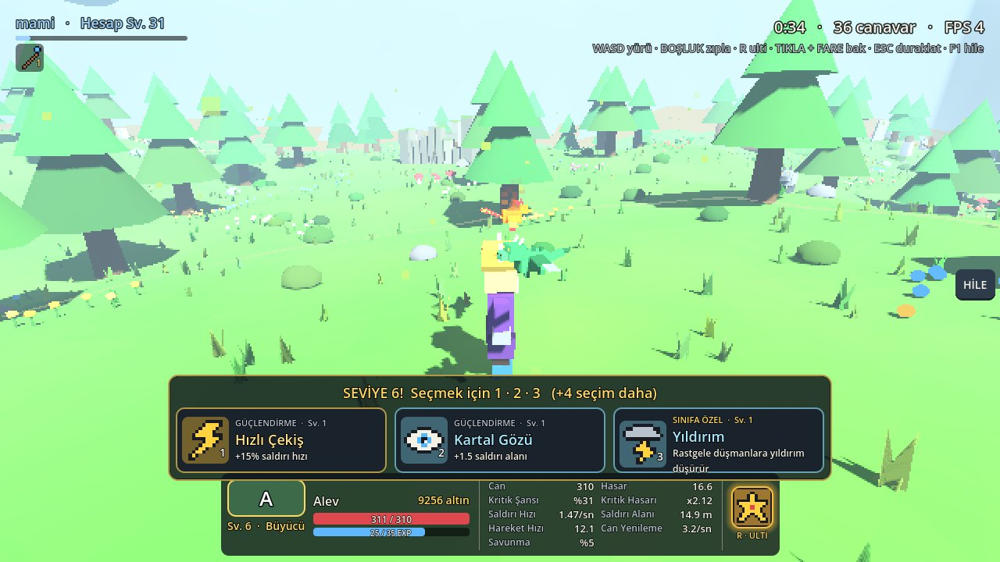
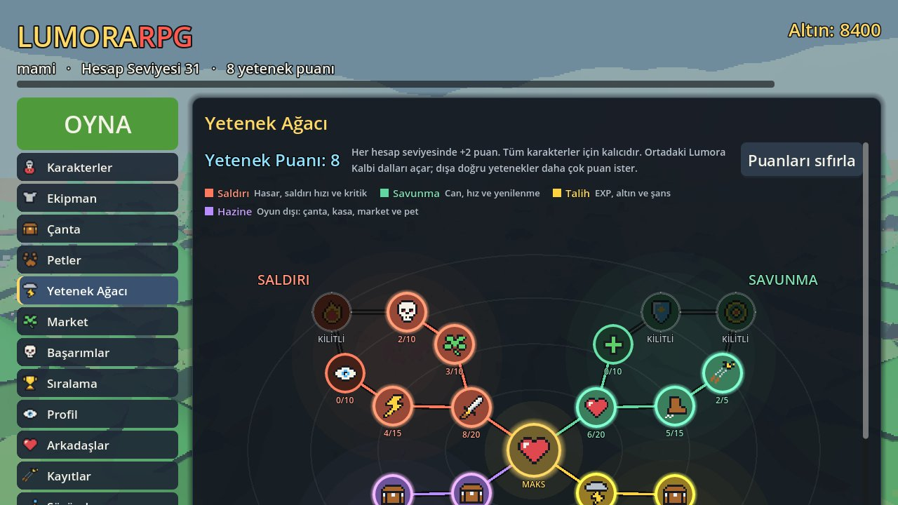
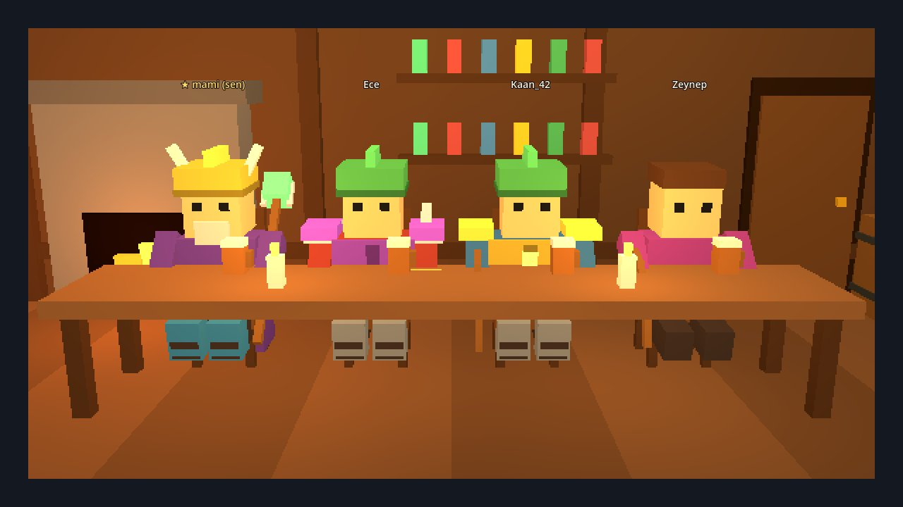
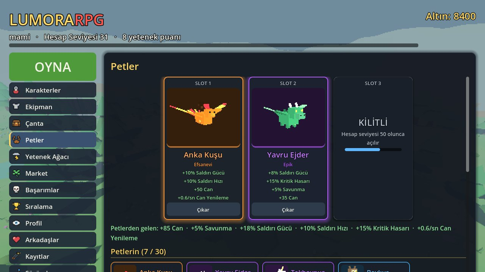
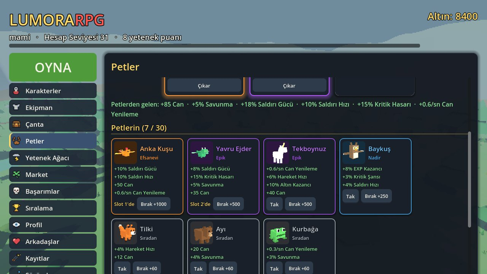
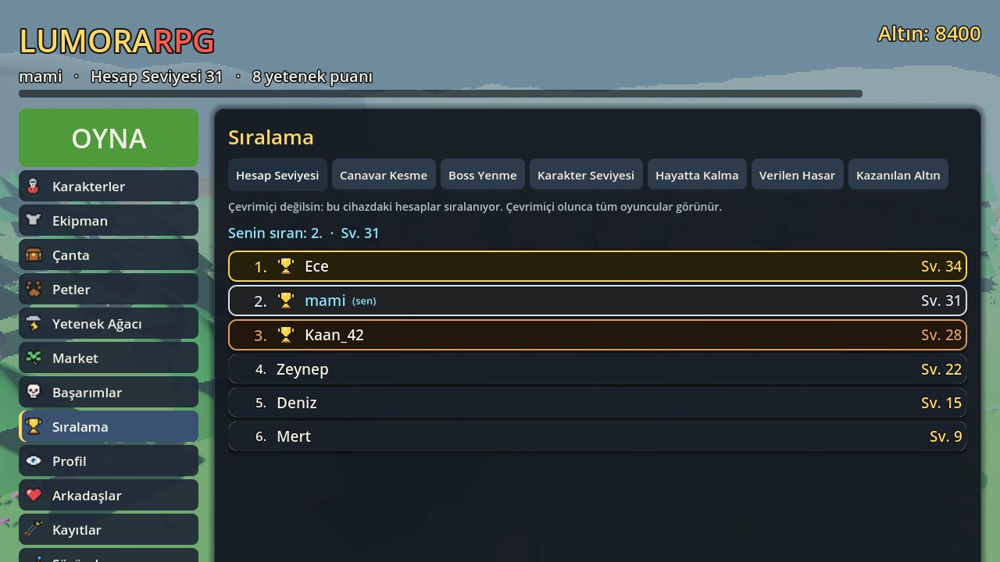
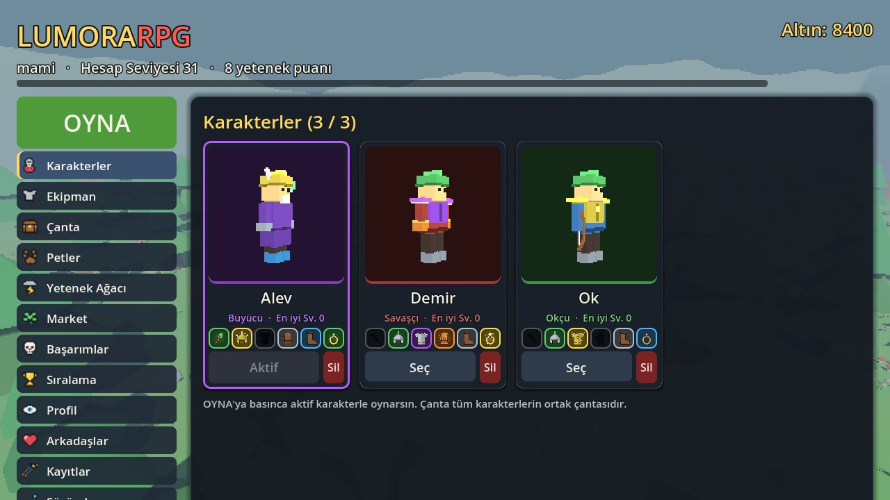
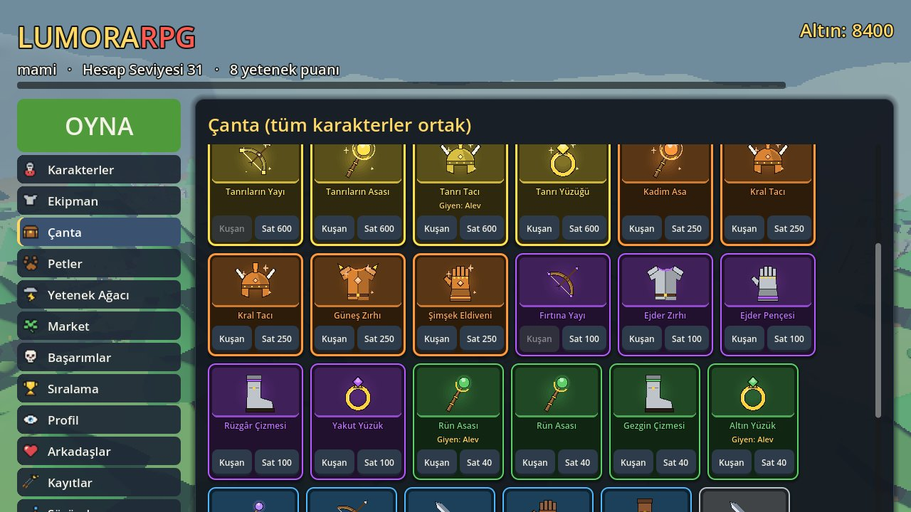

<div align="center">

# LumoraRPG

**Megabonk tarzı 3D pixel-art roguelike survivor: dalga dalga gelen canavarlar, kendiliğinden saldıran silahlar, boss'lar, petler, yetenek ağacı ve arkadaşlarınla canlı co-op.**

**[Tarayıcıda oyna →](https://highlvmami.github.io/LumoraRPG/)** · **[Windows için indir](https://github.com/highlvmami/LumoraRPG/releases/download/latest/LumoraRPG-windows.zip)**

Türkçe · [English](README.en.md)

<p>
  
  
  
  
  
  
  
</p>

</div>

Bir karakter seçip açık bir haritaya iniyorsun; canavarlar her yönden gelir, silahların menzile gireni kendiliğinden vurur, sen de hareket edip hayatta kalmaya çalışırsın. Her seviyede üç karttan birini seçip o oyunluk güçlenirsin, her beş dakikada bir boss gelir. Oyun bitince kazandığın EXP, altın, eşya ve kasalar hesabında kalır: ekipman, petler ve yetenek ağacıyla bir sonraki oyuna daha güçlü başlarsın. Oyun Godot 4.5 ile yazıldı; tarayıcıda ve Windows'ta çalışır, çevrimiçi hesaplar ve co-op küçük bir Node.js sunucusundan geçer.

> Çevrimiçi sunucu Render'ın ücretsiz planında çalışıyor. Bir süre kimse bağlanmazsa uykuya geçer; sonraki ilk bağlantı bir dakika kadar sürebilir. Sunucuya ulaşılamazsa oyun bu cihazdaki hesapla çevrimdışı açılır.

## Ekran görüntüleri

<p align="center">
  
</p>

<p align="center">
  
  
</p>

<p align="center">
  
  
</p>

<p align="center">
  
  
  
</p>

<p align="center"><sub>Oyun içi · Yetenek ağacı · Taverna (oda) · Pet slotları ve pet listesi · Sıralama · Karakterler · Çanta. Görüntüler örnek verilerle çekildi.</sub></p>

## Özellikler

### Oynanış
- **Rastgele haritalar:** Sakin Orman, Sahil Kasabası ve Ölümcül Zindan; her oyun birinde başlar.
- **Kendiliğinden saldırı:** menzil çemberine giren en yakın canavar vurulur. Sınıf silahının yanında 5 silaha kadar taşınır (Dönen Kılıçlar, Ateş Topu, Yıldırım, Kutsal Alan ve sınıfa özel skill), her biri 5 seviye.
- **Seviye kartları:** her seviyede oyun durmadan 3 kart açılır (1 · 2 · 3 ya da tıklayarak); güçlendirmeler o oyun boyunca geçerlidir.
- **Canavarlar zamanla değişir:** balçık, hızlı kurt, taş atan goblin ve dev örümcek; sayıları ve güçleri artar.
- **Boss'lar:** her 5 dakikada Orman Devi ya da Örümcek Kraliçe. Saldırılarını yerde kırmızı alanla gösterirler, canları azaldıkça öfkelenip yeni saldırılar açarlar.
- **Ulti (R / Q):** her sınıfın iki ultisi var, haritadaki tüm düşmanlara vurur.

### Karakterler, eşyalar ve kasalar
- Hesapta 4 karaktere kadar: **Savaşçı**, **Okçu**, **Büyücü**, **Gölge**.
- 6 nadirlik (Sıradan → Tanrısal) ve 6 ekipman yuvası; takılan eşyalar karakterin üstünde görünür.
- **Ortak çanta:** slota ve nadirliğe göre filtre, her zaman nadirliğe göre sıralı; başka karakterin taktığı eşyalar en sonda. Üstüne gelince özellikler, takılı eşyayla karşılaştırmalı görünür.
- **Kasalar:** boss'lar kasa bırakır, Market'ten de alınır; çark dönüp kazandığın eşyada durur.

### Petler
- Yumurtadan çıkan **9 pet**, 4 nadirlikte: Ayı, Tilki, Kurbağa (Sıradan); Minotor, Baykuş, Kaplumbağa (Nadir); Tekboynuz, Yavru Ejder (Epik); Anka Kuşu (Efsanevi).
- Hesap seviyesi 10, 25 ve 50'de açılan 3 slot; slottaki petler statlarını verir ve oyunda küçük hâlleriyle seni takip eder (uçanlar üstünde süzülür).
- **Pet Koleksiyonu:** tüm petler nadirliğe göre; bulunanlar renkli, bulunmayanlar gri.

### Yetenek ağacı
- Ortada **Lumora Kalbi**, etrafına dört dal açılır; her dalın kendi rengi var: **Saldırı**, **Savunma**, **Talih** ve oyun dışı **Hazine** (çanta yeri, kasa şansı, market indirimi, satış fiyatı, eşya düşme şansı, yumurta şansı).
- Her hesap seviyesi 2 yetenek puanı verir; dışa doğru yetenekler daha çok puan ister. İstediğin zaman sıfırlanır.

### Çevrimiçi
- **Hesaplar:** kullanıcı adı ve şifreyle; oyunun sunucuda saklanır, her bilgisayardan aynı hesapla girersin. "Beni hatırla" ile şifre sorulmaz.
- **Taverna odası:** oda kur, arkadaşını davet et ya da 5 harfli kodu ver (en fazla 4 kişi). Odadakiler tavernada masaya oturur; biri katılınca karakteri kapıdan girip boş sandalyeye oturur. Ev sahibi OYNA'ya basınca herkes aynı haritada canlı oynar.
- **Sıralamalar:** hesap seviyesi, canavar kesme, boss yenme, karakter seviyesi, hayatta kalma süresi, verilen hasar ve kazanılan altın.
- **Arkadaşlar:** çevrimiçi durumu ve adının yanında hesap seviyesi; şu an çevrimiçi olanlar listesi.

### Diğer
- 24 başarım (altın ödüllü), son 50 oyunun kayıtları, sürüm notları, grafik/kamera/arayüz ayarları.
- Windows sürümü her açılışta kendini günceller (sadece küçük oyun paketini indirir).

## Kontroller

| Tuş | Eylem |
|---|---|
| WASD / ok tuşları | Yürü |
| Boşluk | Zıpla |
| Fare | Kamerayı döndür (önce oyun penceresine tıkla) |
| Fare tekerleği | Yaklaş / uzaklaş |
| 1 · 2 · 3 | Seviye kartı seç |
| R / Q | Ulti |
| Esc / P | Duraklat (devam, kalite, ana menü, boostlar) |
| F1 | Geliştirici menüsü |

## Nasıl çalışır

- **Veri ile denge:** canavarlar, silahlar, eşyalar, petler, yetenekler ve başarımlar `data/` altındaki JSON dosyalarında; sayıları değiştirmek için koda dokunmaya gerek yok.
- **Pixel görünüm:** dünya düşük çözünürlüklü bir SubViewport'ta çizilip büyütülür, arayüz ise tam çözünürlükte keskin kalır. Modeller kutulardan kod ile kurulur, görsel dosya yoktur.
- **Co-op:** oyunu odayı kuran oyuncunun bilgisayarı yönetir (düşmanlar, hasar, ödüller). Sunucu sadece mesajları iletir; ev sahibi saniyede 10 kez durum gönderir, diğerleri kendi hareketlerini ve vuruşlarını yollar.
- **Hesaplar:** sunucu şifreleri yalnızca scrypt özeti, oturum anahtarlarını sha256 özeti olarak tutar. Oyun kaydı JSONB olarak saklanır ve en yeni kayıt kazanır; sıralamalar da bu kayıtlardan hesaplanır.
- **Sürekli teslim:** her PR'da GitHub Actions Godot testlerini, sunucu testini ve iki oyunlu co-op testini çalıştırır, web sürümünün Chrome'da açıldığını kontrol eder. `main`'e birleşince web sürümü GitHub Pages'e, Windows sürümü Releases'e yüklenir.

## Teknolojiler

| Parça | Teknoloji |
|---|---|
| Oyun | Godot 4.5 (GDScript) |
| Sunucu | Node.js, `ws`, `pg` |
| Veritabanı | PostgreSQL (yoksa sunucu hafızası) |
| Yayın | GitHub Pages (web), GitHub Releases (Windows), Render (sunucu) |
| Testler | Godot headless testleri, Node sunucu testi, headless Chrome |

## Proje yapısı

| Klasör | İçerik |
|---|---|
| `scripts/` | Oyun kodu: oyuncu, düşmanlar, silahlar, ilerleme, arayüz, ağ |
| `data/` | Denge ve içerik (JSON) |
| `scenes/` | Açılış (güncelleyici) ve ana sahne |
| `server/` | Çevrimiçi sunucu: hesaplar, odalar, davetler, sıralamalar, co-op aktarımı |
| `tests/` | Otomatik testler |
| `docs/` | Yol haritası ve ekran görüntüleri |

## Çalıştırma

1. [Godot 4.5](https://godotengine.org/download) (standart sürüm) indir, **Import** ile `project.godot` dosyasını aç, **F5** ile başlat.
2. Sunucuyu yerelde denemek için:

```bash
cd server
npm install
node index.js                  # ws://localhost:8080
```

Oyunu `-- --server=ws://localhost:8080` ile açınca bu sunucuya bağlanır. `DATABASE_URL` verilirse hesaplar PostgreSQL'de tutulur.

Testler:

```bash
godot --headless --path . -s res://tests/smoke_test.gd
godot --headless --path . -s res://tests/coop_test.gd    # node gerekir
(cd server && node test.js)
```

Tasarım ve yol haritası: [docs/ROADMAP.md](docs/ROADMAP.md)
